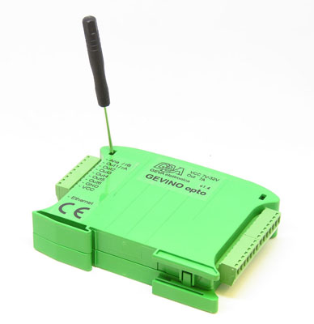
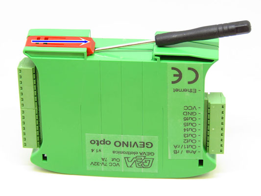
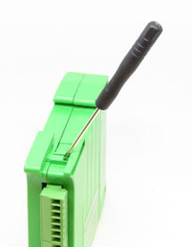
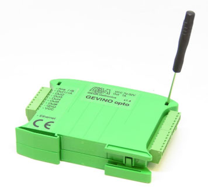
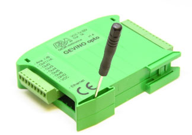
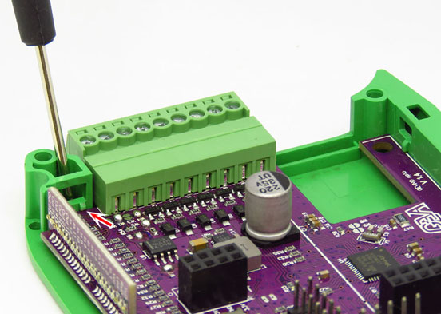
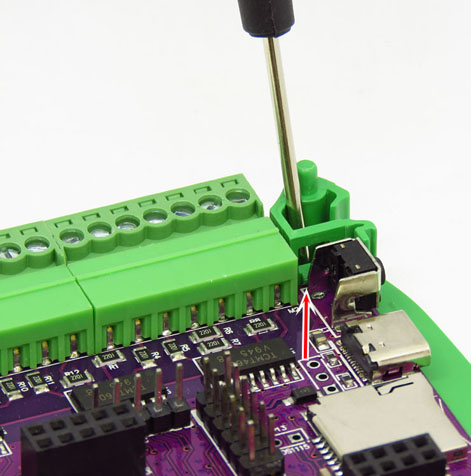

# Opening of GEVINO Opto

The **GEVINO Opto** ships in a modular DIN-rail plastic enclosure held together by snap-fit plastic
hooks. **You normally don't need to open it.**

> ℹ️ **Note — you don't open the case to reach the SD card.** The micro-SD slot is accessible from
> the outside, behind the front door. You only need to open the enclosure for **internal
> modifications** (fitting an optional module, changing a jumper/DIP setting, inspecting the board).

A few of the hooks are **tiny and easy to snap**, so follow the order below and never force the
cover.

## Before you start

- **Power off** the GEVINO and disconnect it from the power supply.
- Work on a clean, flat surface. A small flat screwdriver only helps to *gently* nudge a hook —
  never to pry hard.

---

## 1 · Remove the red hook

Release the **red DIN-rail latch** on the back of the case first, so the body is free to handle.

---

## 2 · Open the 4 hooks

Release the **4 main hooks** on the sides of the enclosure. Work one at a time, evenly around the
case — don't lever the cover up while a hook is still engaged.

Once all four are released, lift the cover **straight off**. If it resists, stop — a hook is still
engaged.

---

## 3 · Save the 2 small hooks

Inside, near the board's edge, there are **2 tiny hooks**. These are the most fragile part of the
whole enclosure — **easy to break, even during insertion of the card.**

> 🛈 **GEVA's tip:** *to avoid breaking the tiny hooks — even during the insertion of the card —
> fold the wall outwards.*
>
> *(Per evitare di rompere i gancetti minuscoli, anche durante l'inserimento della card, piegare
> verso l'esterno la parete.)*

Flex the wall **outward**, just enough to clear the part, then handle it **straight** with light
pressure. Never push at an angle against the small hooks.

---

## Closing the enclosure

1. Make sure the **2 small hooks** are intact and correctly positioned.
2. Lower the cover **straight down** onto the body — do not slide it sideways across the hooks.
3. Press gently until the **4 main hooks** click home, one by one.
4. **Re-engage the red DIN-rail hook.**
5. Give the case a light squeeze all round to confirm every hook has clicked. The cover should sit
   flush with no gaps.

---

## If a small hook breaks

It is the most common mishap and it is **not fatal**: the cover is still retained by the 4 main
hooks and the DIN-rail latch, and the board keeps working normally. For a replacement cover,
contact GEVA.

- Website: https://www.gevaelettronica.it
- Email: info@gevaelettronica.it
